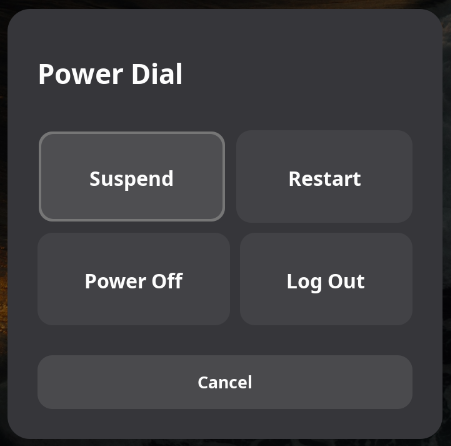

# Power Dial

A GNOME Shell extension that provides a quick power menu with suspend, restart, power off, and logout options.

> Restart your system after enabling the extension for the keyboard shortcut to work properly.

## Usage

### Accessing Power Dial

**Two ways to open the menu:**

- **Keyboard Shortcut**: Press `Alt + F5` (or your custom shortcut)
- **Top Bar Icon**: Click the power icon in the GNOME top bar (if enabled)

> Both methods open the same power menu with suspend, restart, power off, and logout options.

## Requirements

-   GNOME Shell 45 or later
-   Works on both X11 and Wayland

## Power Options

-   **Suspend**: Put system to sleep (immediate action)
-   **Restart**: Reboot the system (with confirmation)
-   **Power Off**: Shutdown the system (with confirmation)
-   **Log Out**: End current user session (with confirmation)

## User Preferences

### Keyboard Shortcut
Customize the key combination to open Power Dial:

-   **Default**: `Alt + F5`
-   **Customizable**: Access through GNOME Extensions preferences
-   **Flexible**: Set any key combination that works for you

### Display Mode
Choose how the power options are presented:

-   **Stacked** (default): Vertical list layout - compact and traditional
-   **Tiled**: 2x2 grid layout - modern card-based interface with keyboard navigation

### Top Bar Icon
Control the visibility of the Power Dial icon in the GNOME top bar:

-   **Enabled** (default): Show icon in top bar for quick access
-   **Disabled**: Hide icon - access only via keyboard shortcut

## Installation

Download and enable the extension from the GNOME Extensions website:

[Download Power Dial Extension](https://extensions.gnome.org/extension/8563/power-dial/)
