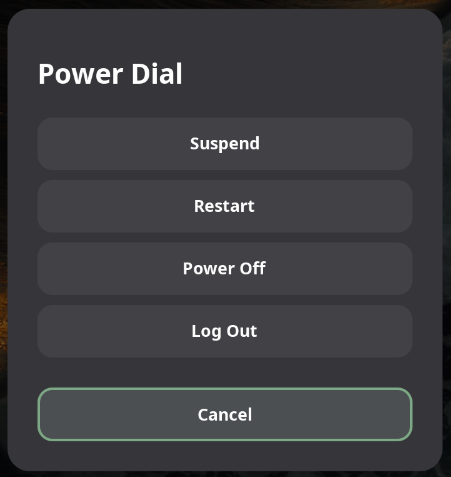

# Power Dial

A GNOME Shell extension that provides a quick power menu with suspend, restart, power off, and logout options.

> Restart your system after enabling the extension for the keyboard shortcut to work properly.

## Keyboard Shortcut

-   **Default**: `Alt + F5`
-   **Customizable**: Click the gear icon in Extensions to update shortcut.

## Requirements

-   GNOME Shell 45 or later
-   Works on both X11 and Wayland

## Power Options

-   **Suspend**: Put system to sleep (immediate action)
-   **Restart**: Reboot the system (with confirmation)
-   **Power Off**: Shutdown the system (with confirmation)
-   **Log Out**: End current user session (with confirmation)

## Installation

Download and enable the extension from the GNOME Extensions website:

[Download Power Dial Extension (Link to be added)](https://extensions.gnome.org/extension/...)
